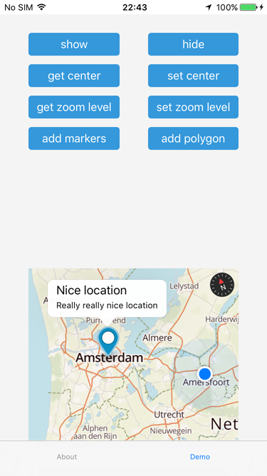
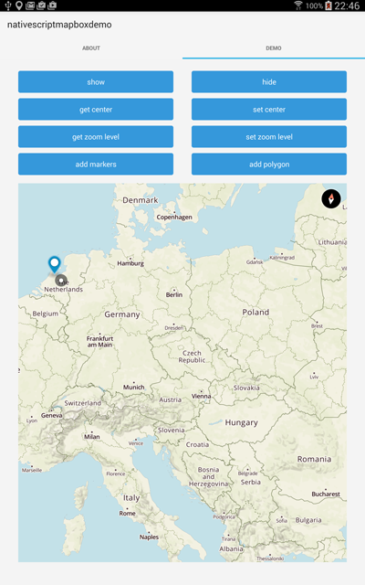

# nativescript-mapbox demo app

Demo app for the {N} [mapbox plugin](https://www.npmjs.com/package/nativescript-mapbox)

## Installation

This app is built with the [NativeScript CLI](https://github.com/NativeScript/nativescript-cli).
Once you have the [CLI installed](https://github.com/NativeScript/nativescript-cli#installation), start by cloning the repo:

```
$ git clone https://github.com/EddyVerbruggen/nativescript-mapbox-demo
$ cd nativescript-mapbox-demo
$ cd Mapbox
```

Next, install the app's iOS and Android runtimes, as well as the app's npm dependencies:

```
$ tns install
```

Also add typescript support to your project because it's awesome and this plugin has TS definitions:

```
$ tns install typescript
```

From there you can use the `run` command to run the demo app on iOS:

```
$ tns run ios --emulator
```

.. or on Android

```
$ tns run android --emulator
```

## Screenshots




